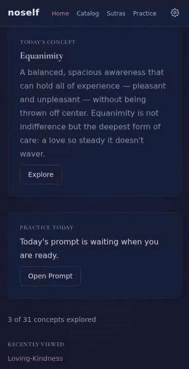
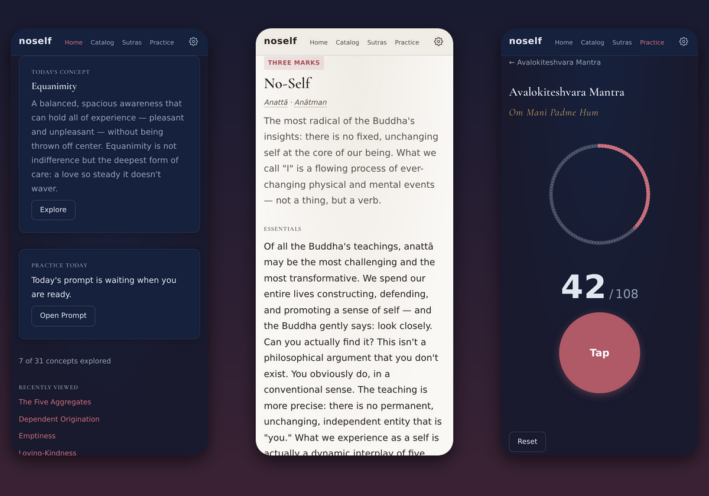
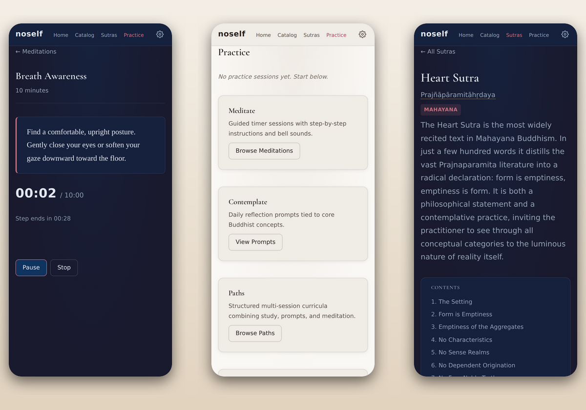
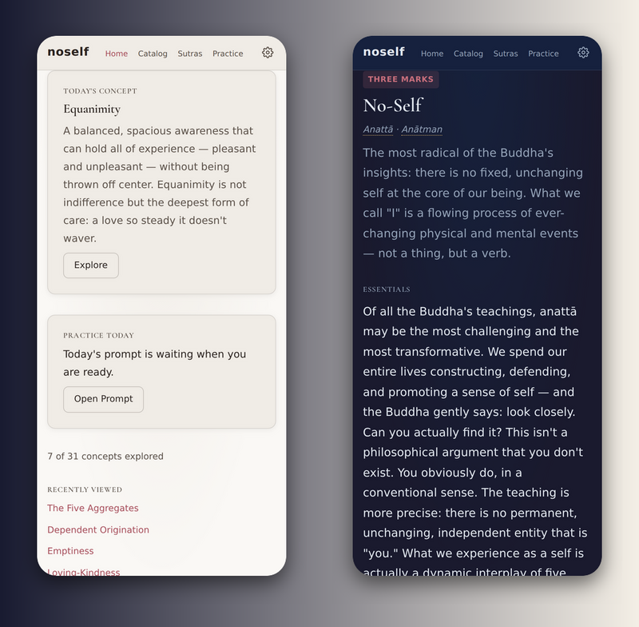

<div align="center">

# noself

**A quiet place to study the Dharma — and then actually practise it.**

Thirty-one core Buddhist teachings, four sutras, seven mantras, six guided meditations and a full devotional puja, in a calm, installable app that works offline and never asks for an account.




</div>

---

## Why noself?

Most dharma apps are either a library or a timer. **noself is both, joined up.** You read about _anattā_ in the morning, sit with a prompt about it at lunch, and do a ten-minute guided meditation on it in the evening. Your history ties the three together.

The tradition calls these the three kinds of wisdom: _sutamaya paññā_ (from study), _cintāmaya paññā_ (from reflection) and _bhāvanāmaya paññā_ (from meditation). noself is built around all three.

<p align="center">
  
</p>

## What's inside

### 📖 Study: 31 concepts, three depths each

Every teaching is written at three levels, so it grows with you:

- **Brief:** the idea in a sentence or two
- **Essentials:** an accessible introduction
- **Deep:** history, how traditions differ, and the subtle points

Each concept comes with sutta quotes and commentary that link it back to practice. Pali and Sanskrit terms are **tappable**, with pronunciation, literal meaning and etymology (e.g. _an_ (not) + _attā_ (self)).

| Category            | Concepts                                                                           |
| ------------------- | ---------------------------------------------------------------------------------- |
| Foundational        | Four Noble Truths · Noble Eightfold Path · Three Jewels · Middle Way · Three Marks |
| Three Marks         | Anicca · Dukkha · Anattā                                                           |
| Mind & Practice     | Sati · Ānāpānasati · Bhāvanā · Samatha · Vipassanā · Five Precepts · Karma         |
| Buddhist Psychology | Five Aggregates · Three Poisons · Dependent Origination · Twelve Links             |
| Brahmavihāras       | Mettā · Karuṇā · Muditā · Upekkhā                                                  |
| Mahāyāna            | Śūnyatā · Buddha-nature · Bodhisattva · Interbeing · Prajñā                        |
| Liberation          | Nirvāṇa · Saṃsāra · Awakening                                                      |

A new **Concept of the Day** appears at your local midnight.

### 📜 Sutras

Section-by-section study editions of the **Heart Sutra**, **Diamond Sutra**, **Ānāpānasati Sutta** and **Dhammapada**, each with a table of contents and inline term glossary. Pali and Sanskrit primers explain the scripts and sounds.

### 🧘 Practice

<p align="center">
  
</p>

- **Guided meditations:** Breath Awareness, Ānāpānasati (all 16 contemplations), Body Scan, Mettā, Vipassanā and Open Awareness, at 5–30 minutes. Step-by-step instructions with a synthesised bell at each transition. The timer runs on wall-clock time, so a locked phone doesn't stretch your sit.
- **Contemplation prompts:** a daily reflection question with guidance, drawn from 28 prompts you can browse by concept and depth. Mark one "Sat with this" when you've spent time with it.
- **Practice paths:** multi-day curricula (_7-Day Mettā_, _Foundations of Mindfulness_, _Exploring Non-Self_) that combine reading, reflection and meditation.
- **Mantras:** seven mantras, including _Oṃ Maṇi Padme Hūṃ_ and the Vajrasattva hundred-syllable mantra, with a syllable breakdown, meaning, and a **108-bead mala counter** with haptic taps and a bell at every quarter mala.
- **Puja:** the Triratna **Sevenfold Puja**, to study verse by verse or to perform as a guided ritual with timed steps.
- **History & streaks:** every completed meditation, prompt, path session, puja and mala is logged so you can see your continuity over time.

### 🌗 Made for slow, daily use

<p align="center">
  
</p>

- **Three expertise levels.** _Exploring_ gives you simple introductions. _Deepening_ adds fuller teachings, sutras and mantras. _Immersed_ unlocks everything, including pujas and original texts.
- **Light, dark or auto theme**, adjustable text size, and Cormorant Garamond typography designed for long reading.
- **Gentle reminders.** Optional in-app or push notifications at a time you choose. After a few quiet days they invite you to begin again, without guilt-tripping.
- **Offline-first PWA.** Install it to your home screen; all the content is precached.
- **Private by design.** No accounts and no analytics. Your history lives in your browser's `localStorage`.

---

## Getting started

```bash
npm install
npm run dev
```

Open the URL Vite prints, then use the ⚙️ settings panel to pick your expertise level and theme.

### Push reminders (optional)

Push reminders are sent by a scheduled Netlify Function (`netlify/functions/send-daily-reminders.ts`, which runs hourly) and use Netlify Blobs for storage. To enable them, set:

| Variable                | Where            | Purpose                                 |
| ----------------------- | ---------------- | --------------------------------------- |
| `VITE_VAPID_PUBLIC_KEY` | build            | Lets the browser subscribe to push      |
| `VAPID_PUBLIC_KEY`      | Netlify function | Signs push messages                     |
| `VAPID_PRIVATE_KEY`     | Netlify function | Signs push messages                     |
| `VAPID_SUBJECT`         | Netlify function | Contact URI, e.g. `mailto:you@site.org` |

Without them, reminders fall back to in-app banners and local notifications.

## Scripts

| Command            | Description                                           |
| ------------------ | ----------------------------------------------------- |
| `npm run dev`      | Start dev server                                      |
| `npm run build`    | Typecheck and build for production                    |
| `npm run preview`  | Serve the production build locally                    |
| `npm run check`    | Typecheck + lint + format check + dead code detection |
| `npm run test:run` | Run tests once                                        |
| `npm test`         | Run tests in watch mode                               |
| `npm run lint:fix` | Auto-fix lint issues                                  |
| `npm run format`   | Format all files with Prettier                        |
| `npm run deploy`   | Check, test, build and deploy to Netlify              |

## Tech stack

- **TypeScript** (strict) + **Vite**, with no UI framework: small, fast, hash-routed views
- **YAML content** validated at load time, so new teachings need no code changes
- **Zod** for runtime config validation
- **vite-plugin-pwa** + Workbox for offline support and installability
- **Web Audio API** for the synthesised bell
- **Netlify Functions + Blobs + web-push** for scheduled reminders
- **Vitest** + jsdom (600+ tests), **ESLint 9**, **Prettier**, **Husky**, **Knip**

## Project structure

```
src/
  core/         — views, router, preferences, practice history, reminders
    practice/   — meditation timer, mantra counter, puja, prompts, paths
  content/      — YAML: concepts, sutras, meditations, mantras, pujas,
                  prompts, paths, primers, videos
  config/       — Zod-validated app config
  styles/       — single hand-written stylesheet with light/dark tokens
  utils/        — logger, text formatting, retry/debounce/throttle helpers
  sw.ts         — service worker (precache + push notifications)
netlify/
  functions/    — save/delete push subscriptions, hourly reminder sender
```

## Contributing content

Teachings live in plain YAML under `src/content/`. To add a concept, copy an existing file in `src/content/concepts/`, add its id to `CONCEPT_IDS` in `src/content/concepts/index.ts`, and run `npm run test:run`. YAML files are picked up automatically, and the loader tests check that every concept is present and complete.

## License

[MIT](LICENSE)

<p align="center"><em>May all beings be happy. May all beings be free.</em></p>
